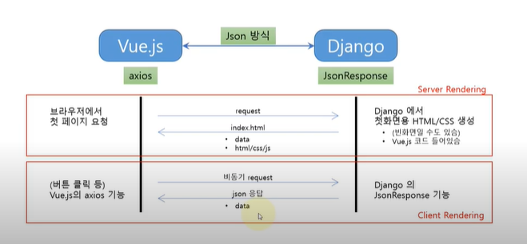

# Vue-Django 연동 설계

> Vue.js - Django 연동 웹 프로그래밍
>
> by. Inflearn

## Todo 앱 설계(Vue-Django연동 방식)

1. 첫 페이지는 Django에서 생성해서, 클라이언트에게 보내 줌

2. 이후 화면 렌더링은 Vue.js 코드에서 수행

3. Data 저장은 서버 측의 DB에 저장(SQLite)

4. Client-Server 간 Data 연동은 JSON 포맷으로

5. Vue.js 의 directive/axios 기능 사용

6. DRF(Django Rest Framework) 대신에 JsonResponse 사용

   

- virtual DOM 처리로, 화면 깜빡임 없음

  => 사용자 경험이 좋아짐

- Data만 트랙픽 감소로 응답속도가 빨라짐